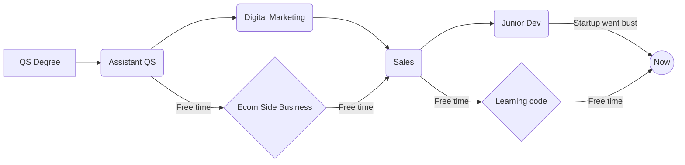

[](https://wobwobbird.github.io/home)

# Hi I'm Guy - Junior Full-Stack Developer

I’m a Full-Stack Developer based in London with two years of intensive self-driven learning and nine months of commercial experience at a PropTech startup.

Recently, I’ve been focusing more on backend development, working with Node.js, Express, server architecture, authentication, and databases including SQLite and PostgreSQL.

```
I love building!
```

[](https://www.linkedin.com/in/guymarshman)


---

## 🛠️ Tech Stack

**Languages:**  
<picture></picture>
<picture></picture>
<picture></picture>
<picture></picture>
<picture></picture>
<picture></picture>

**Frameworks & Libraries:**  
<picture></picture>
<picture></picture>
<picture></picture>
<picture></picture>
<picture></picture>

**Backend & Databases:**  
<picture></picture>
<picture></picture>
<picture></picture>
<picture></picture>
<picture></picture>

**Tools:**  
<picture></picture>
<picture></picture>

**Other Skills & Knowledge:**  
<picture></picture>
<picture></picture>
<picture></picture>
<picture></picture>
<picture></picture>

---

## ⚡ Projects & Work
**Hand Coded Projects**

- **[Mood_Tracker_CLI](https://github.com/wobwobbird/Mood_Tracker)**  
  Mental Health Tracker CLI tool, record mood and review results. Uses Ink to create a full screen TUI, saves results in a SQLite database.  
  [](https://skillicons.dev)  
  `Also used: Ink`  
 
- **[Tap 'O' Matic](https://github.com/wobwobbird/Tap-O-Matic)**  
  A React Native TypeScript random number generator app.  
  README includes Expo Go QR code, scan then view in the Expo Go app  
  [](https://skillicons.dev)  
  `Also used: React Native | Expo`  
    
- **[Super Connect](https://github.com/wobwobbird/Super-Connect-Game)**  
  A two-player turn-based Connect 4–style game built in Unity 6 (URP). Get four in a row: horizontally, vertically, or diagonally to win. Full game with start scene, player naming, scoring, winning screen, music control, 3D background and animations.  
  [](https://skillicons.dev)

**AI Assisted Projects**
- **[Time_Blocks](https://github.com/wobwobbird/Time_Blocks)**  
  Time Blocks Logger is a small time-tracking app: log time by category (e.g. Coding, Learning, Game Dev), see daily and weekly totals, and enforce a 24-hour-per-day limit so you can’t over-log a single day.  
  [](https://skillicons.dev)  
  `Also used: React Admin | Supabase`

**Learning Projects**
- **[Ravenous_Restaurant_Search_API_App](https://github.com/wobwobbird/Ravenous_Restaurant_Search_API_App)**  
  A React web app that searches for restaurants using the Yelp API  
  This was a project for the 'skill path Create a Front-End App with React' on Codecademy.com  
  [](https://skillicons.dev)  

**Commercial Work**
- **iRealty Front-End**  
  Worked as a Junior Front-End Developer at the PropTech startup  
  Converted the customer facing CRM to tablet and mobile responsive, and built a customer support pannel available across the app  
  Built property filtering, comparison tools, and multilingual support (Catalan/French)  
  [](https://skillicons.dev)  

---

## 📝 Currently Learning

```yaml
- AI Chatbots
- Docker
```

---

<details>
  <summary><strong>Career Flow Chart</strong></summary>
  



</details>

<details>
  <summary><strong>...</strong></summary>
  
**Hello World!**  
**LordMarshy**

</details>


